# Laplacian-LoRA: Delaying Oversmoothing in Deep GCNs via Spectral Low-Rank Adaptation

**Laplacian-LoRA** is a simple, interpretable method to delay oversmoothing in deep Graph Convolutional Networks (GCNs) by introducing a **low-rank, spectrally anchored adaptation** of the graph propagation operator.

Instead of redesigning message passing or adding architectural complexity, Laplacian-LoRA directly weakens the **spectral contraction** responsible for oversmoothing while preserving the stabilizing low-pass bias of standard GCNs.

---

## Motivation

Oversmoothing is a fundamental limitation of deep GCNs: as depth increases, node representations collapse toward indistinguishable embeddings. While many prior approaches mitigate this using residual connections, normalization, or rewired graphs, the **spectral cause** of oversmoothing is often left implicit.

From a spectral perspective:
- A GCN applies a fixed low-pass filter derived from the normalized Laplacian.
- Repeated application exponentially suppresses all non-constant Laplacian modes.
- As depth grows, representations collapse into the dominant eigenspace.

**Key question:**  
> Can we delay oversmoothing by weakening spectral contraction *without* destabilizing propagation or removing the low-pass bias?

Laplacian-LoRA answers **yes**.

---

## Core Idea

Laplacian-LoRA introduces a **low-rank spectral correction** to the fixed GCN propagation operator.

### Spectral View
A standard GCN applies the spectral filter:

`g_GCN(λ) = 1 − λ`

Laplacian-LoRA modifies this as:

`g_eff(λ) = (1 − λ)(1 + β(λ))`, where `β(λ) ≥ 0`

This:
- **Weakens per-layer contraction**
- **Preserves stability** (no eigenvalues exceed magnitude 1)
- **Maintains the low-pass inductive bias**

### Why Low-Rank?
The correction is implemented as a **LoRA-style residual** anchored in the Laplacian eigenspace. When restricted to leading eigenvectors, this corresponds to a **low-rank additive correction in node space**, making it:
- Parameter-efficient
- Interpretable
- Easy to integrate into existing GCNs

---

## Method Overview

- Precompute top-`k` Laplacian eigenpairs
- Learn a bounded spectral modulation function θ(λ)
- Apply a depth-annealed correction:
`α_ℓ = α · (ℓ / L)`
- Add the correction as a residual propagation branch at each layer

Early layers behave like standard GCNs; deeper layers receive stronger contraction weakening.

---

## Experimental Setup

- **Datasets:** Cora, CiteSeer, PubMed, CoauthorCS, CoauthorPhysics
- **Depths:** 2, 4, 8, 16, 32
- **Backbone:** Vanilla GCN (no residuals, no batch norm)
- **Hidden dim:** 64
- **Optimizer:** Adam (lr = 0.01, wd = 5e-4)
- **Eigenpairs:** top 64 Laplacian modes
- **Framework:** PyTorch Geometric
- **Hardware:** Single NVIDIA A100 GPU

---

## Results

## 🔹 Accuracy vs Depth

Test accuracy as a function of network depth across benchmark datasets.

As depth increases, standard GCNs suffer rapid performance degradation due to oversmoothing.  
In contrast, Laplacian-LoRA consistently maintains higher accuracy at intermediate depths, effectively extending the usable depth of graph convolution by up to **2×**.
| PubMed | Cora | CiteSeer |
|:--:|:--:|:--:|
| 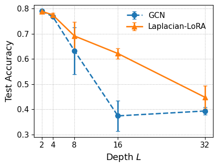 | 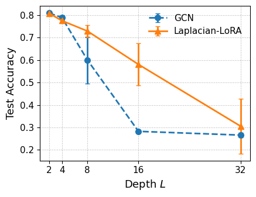 | 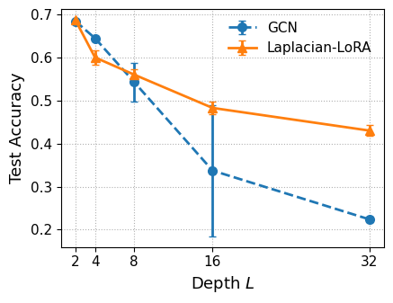 |

| CoauthorPhysics | CoauthorCS |
|:--:|:--:|
| 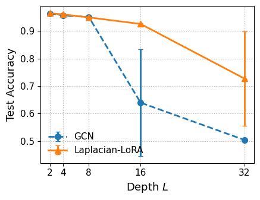 | 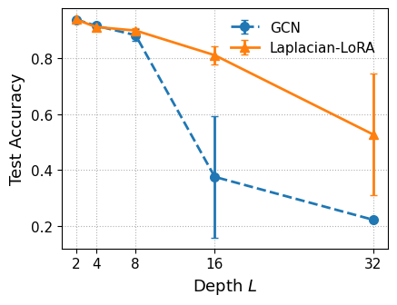 |

**Key observations:**
- Standard GCN accuracy degrades sharply beyond depths 8–16
- Laplacian-LoRA consistently outperforms GCNs at moderate depths
- Both methods eventually degrade, indicating oversmoothing is delayed rather than eliminated

---

## 🔹 Oversmoothing Diagnostics: Embedding Variance

To directly measure representational collapse, we analyze the variance of node embeddings as a function of depth.

Standard GCNs exhibit rapid variance decay, indicating strong contraction toward uniform representations.  
Laplacian-LoRA preserves substantially higher variance at intermediate depths, confirming delayed oversmoothing.

| Cora | CoauthorCS |
|:--:|:--:|
| 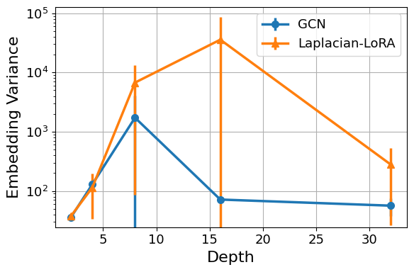 | 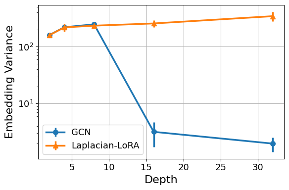 |

**Key observations:**
- Embedding variance in GCNs collapses rapidly with depth
- Laplacian-LoRA slows this collapse significantly
- Representational diversity is retained longer, aligning with improved accuracy trends

---

## 🔹 Spectral Analysis & Diagnostics

This section visualizes how Laplacian-LoRA weakens spectral contraction while preserving stability and the low-pass inductive bias of standard GCNs.

---

### 🔹 Propagation Spectrum

Propagation eigenvalues as a function of the Laplacian eigenvalue `λ`.  
Laplacian-LoRA shifts non-constant modes upward while remaining strictly stable.

| Cora | CoauthorCS |
|:--:|:--:|
| 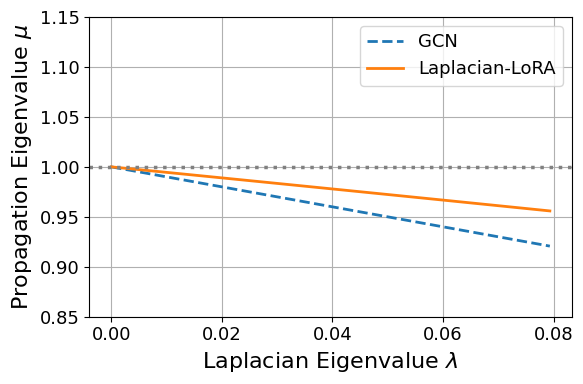 | 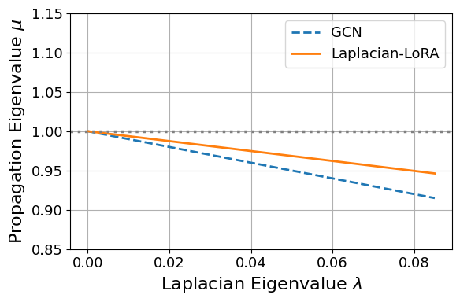 |

---

### 🔹 Depth-wise Spectral Contraction

Depth-dependent contraction ratio governing representational collapse:

`(|μ₂| / |μ₁|)^L`

Laplacian-LoRA slows this decay, delaying oversmoothing.

| Cora | CoauthorCS |
|:--:|:--:|
| 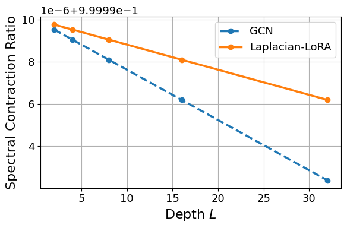 | 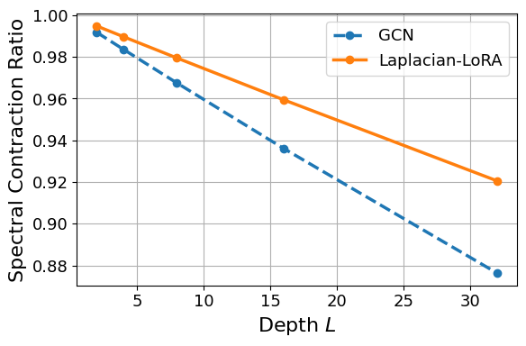 |

---

### 🔹 Frequency-wise Energy Retention

Retained spectral energy after 16 propagation layers:

`E(λ; L) = |μ(λ)|^L`

Laplacian-LoRA preserves substantially more energy at intermediate and high Laplacian frequencies.

| Cora | CoauthorCS |
|:--:|:--:|
| 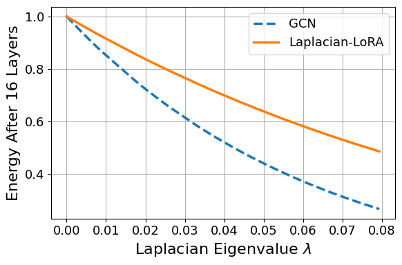 | 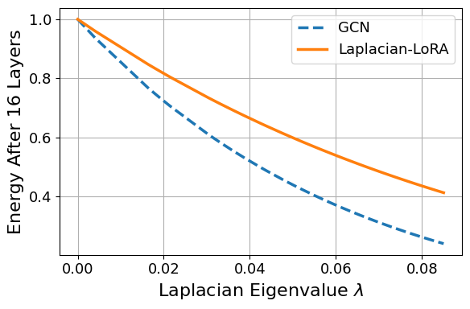 |

Key diagnostics:
- Slower depth-wise spectral contraction
- Improved frequency-wise energy retention
- Controlled rebalancing of Laplacian modes

---

## Key Takeaways

- Oversmoothing is fundamentally a **spectral contraction phenomenon**
- It can be delayed via **principled spectral design**
- Laplacian-LoRA offers a **minimal, interpretable, low-rank** solution
- No architectural redesign required

---

## Limitations & Future Work

- Oversmoothing is delayed but not eliminated
- Partial eigendecomposition limits scalability to very large graphs

Future directions:
- Scalable spectral approximations
- Layer-dependent spectral adaptation
- Combining with residual or normalization-based methods
